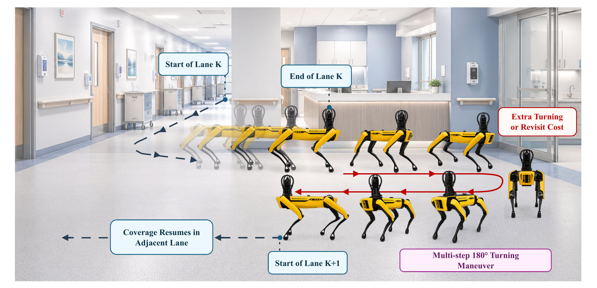

<div align="center">

# Q-TRACE

### Turn and Revisit-Aware Coverage Path Planning for Quadruped Robots

[](https://www.python.org/)
[](#research-scope)
[](#quick-start)

</div>



<p align="center">
  <a href="#method-at-a-glance">Method</a> ·
  <a href="#quick-start">Quick start</a> ·
  <a href="#reproduce-the-experiments">Reproduce</a> ·
  <a href="#real-robot-demonstrations">Robot trials</a> ·
  <a href="#repository-structure">Repository structure</a>
</p>

## Overview

Q-TRACE is a grid-based coverage path planner developed for robotic coverage
tasks in cluttered environments, with special attention to quadruped motion.
It combines four components:

1. a robot-clearance-aware binary occupancy representation
2. wavefront-guided selection of directly reachable uncovered neighbors
3. heading-augmented A\* reconnection when local coverage is saturated
4. Bayesian optimization of seven local-selection and reconnection weights

The implementation is extracted from the accompanying research notebook and
reorganized as a documented Python package. Experimental plotting cells,
duplicate utilities, interactive notebook state, and unrelated baseline
implementations are excluded from the core package.

## Method at a glance

### 1. Local wavefront-guided selection

For the current cell $q_t$ and an uncovered feasible neighbor $v$, Q-TRACE
maximizes

$$
S(v)=\lambda_w W(v)-\lambda_t C_{\mathrm{turn}}(v)+\lambda_u U(v),
$$

where $W(v)$ is the wavefront value, $C_{\mathrm{turn}}(v)$ is the
heading-change cost, and $U(v)$ is the number of uncovered feasible
neighbors of $v$. Local candidates are uncovered by construction, so the
local score contains exactly these three terms.

### 2. Turn-aware A\* reconnection

When no uncovered neighbor is available, a heading-augmented A\* search finds
a route to a remaining uncovered cell. Its cumulative cost is

$$
g(n)=\alpha L_n+\beta R_n+\gamma T_{90,135,n}+\delta T_{180,n},
$$

where $L_n$ is actual movement length, $R_n$ is repeated traversal,
$T_{90,135,n}$ counts moderate heading changes, and $T_{180,n}$ counts
reverse turns. Repeated traversal is therefore penalized during reconnection,
where motion can pass through previously covered cells.

The reconnect policy is deterministic: Q-TRACE shortlists the nearest
uncovered targets, breaks distance ties using wavefront priority and grid
coordinates, computes turn-aware A\* routes, and selects the lowest weighted
route cost.

### 3. Adaptive motion model

In `adaptive` mode, the planner evaluates both:

- 4-connected orthogonal motion and
- valid 8-connected motion with diagonal gap checking

Complete coverage is prioritized first. The final path is then selected by
actual movement length with deterministic metric-based tie-breaking.

## Quick start

```bash
# After cloning or extracting the repository:
cd Q-TRACE

python -m venv .venv
python -m pip install -e .

python -m qtrace plan \
  --dataset data/evaluation_set.txt \
  --map-id 6 \
  --config configs/global.toml \
  --output results/example
```

The command creates:

- `coverage_path.png` - coverage visualization;
- `path.csv` - ordered grid waypoints; and
- `metrics.json` - coverage, distance, revisit, turn, and motion-mode metrics.

Programmatic use is equally small:

```python
from qtrace import PlannerConfig, QTracePlanner, load_dataset

record = load_dataset("data/evaluation_set.txt")[0]
config = PlannerConfig.from_toml("configs/global.toml")
result = QTracePlanner(config).plan(record.grid_map)

print(result.motion_model)
print(result.metrics.as_dict())
```

## Reproduce the experiments

### Run the complete 100-map evaluation

```bash
python -m qtrace evaluate \
  --dataset data/evaluation_set.txt \
  --config configs/global.toml \
  --output results/evaluation
```

For a short installation check, add `--limit 4`. To evaluate one environment
category, add one of:

```text
--category low_obstacle
--category cluttered
--category narrow_passage
--category clustered_obstacle
```

### Rerun Bayesian optimization on the disjoint 40-map set

```bash
python -m pip install -e ".[optimize]"

python -m qtrace optimize \
  --dataset data/optimization_set.txt \
  --scope global \
  --trials 100 \
  --seed 42 \
  --output results/optimization.json
```

Replace `global` with a category name for category-specific optimization. The
study uses Optuna's seeded TPE sampler. Parameter bounds, objective weights,
map count, seed, and best trial are written into the resulting JSON file.

The optimized configurations are stored as TOML files under
[`configs/`](configs/). Use the global configuration for a single consistent
evaluation across all map categories; use category-specific files only for
the corresponding controlled experiment.

## Real-robot demonstrations

The following full-length MP4 recordings show the planned trajectory, Webots
execution, live physical-robot coverage map, and Boston Dynamics Spot
experiment in a synchronized research view.

### Clustered-obstacle trial

`S-10-CO-05 / R-10-CO-05`

[](assets/videos/S_10_CO_05.mp4?raw=true)

[▶ Watch the complete MP4 video](assets/videos/S_10_CO_05.mp4?raw=true)

### Narrow-passage trial

`S-10-NP-08 / R-10-NP-08`

[](assets/videos/S_10_NP_08.mp4?raw=true)

[▶ Watch the complete MP4 video](assets/videos/S_10_NP_08.mp4?raw=true)

## Dataset organization

The repository contains two disjoint line-oriented datasets:

| Dataset | Maps | Purpose |
|---|---:|---|
| `data/optimization_set.txt` | 40 | Parameter tuning only |
| `data/evaluation_set.txt` | 100 | Final held-out evaluation |

Each dataset covers four environment categories and five grid resolutions:
5, 10, 20, 35, and 50. See [`data/README.md`](data/README.md) for the record
format and ordering assumptions.

## Repository structure

```text
Q-TRACE/
├── src/qtrace/              # Planner, A*, metrics, evaluation, optimization
├── configs/                 # Global and category-specific TOML parameters
├── data/                    # Disjoint optimization and evaluation map sets
├── examples/                # Minimal Python API example
├── tests/                   # Deterministic unit and integration checks
├── assets/
│   ├── method/              # Workflow figure in PNG and PDF formats
│   ├── results/             # Example planner visualization
│   └── videos/              # Full-length MP4 robot trials
├── .github/workflows/       # Python 3.11/3.12 test workflow
├── Dockerfile               # Containerized quick-start execution
└── pyproject.toml           # Installable package and CLI metadata
```

## Research scope

This repository presents the research reference implementation of Q-TRACE, a turn and revisit-aware coverage path planning framework, which combines clearance-aware map preprocessing, wavefront-guided local selection, and turn-aware A* reconnection to achieve complete coverage while reducing travel distance, repeated traversal, and costly heading changes.

## Citation

If this repository contributes to your work, please cite the associated
Q-TRACE paper. The final bibliographic entry and publication link should be
added here when the manuscript metadata becomes public.

---

<div align="center">
  <sub>Q-TRACE research implementation · deterministic configuration · held-out evaluation maps · real-robot demonstrations</sub>
</div>
